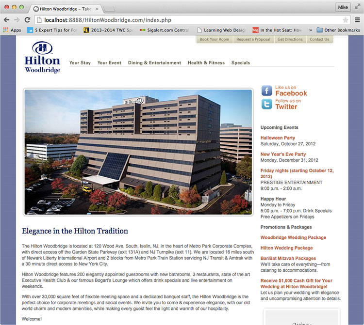
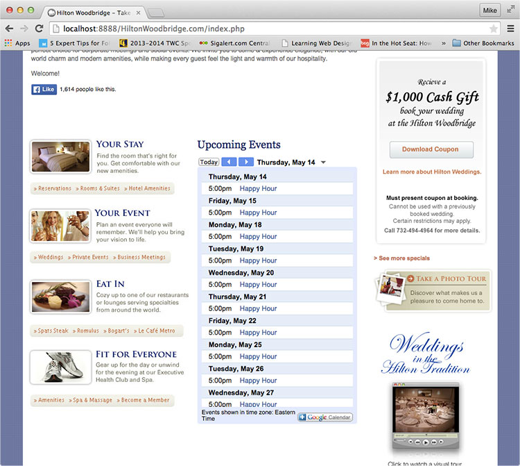
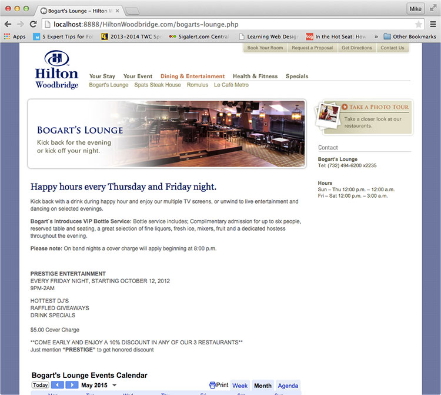
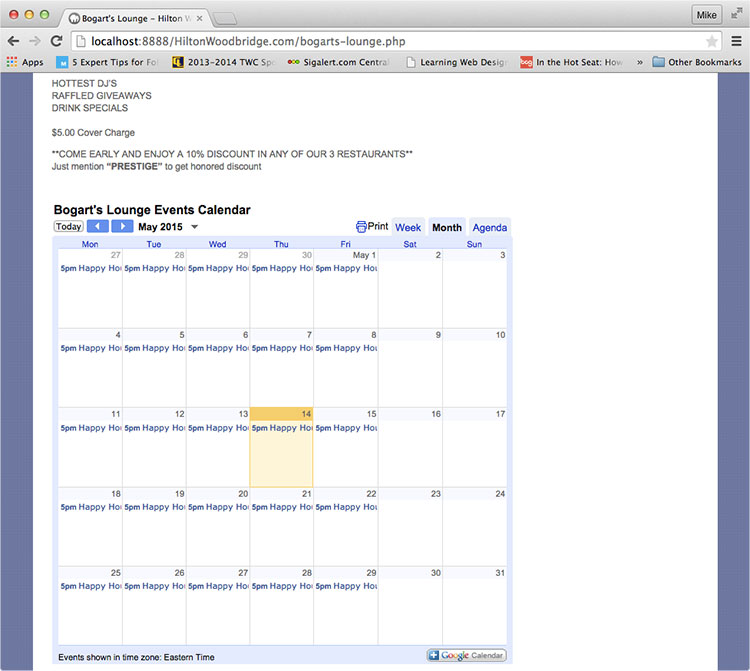
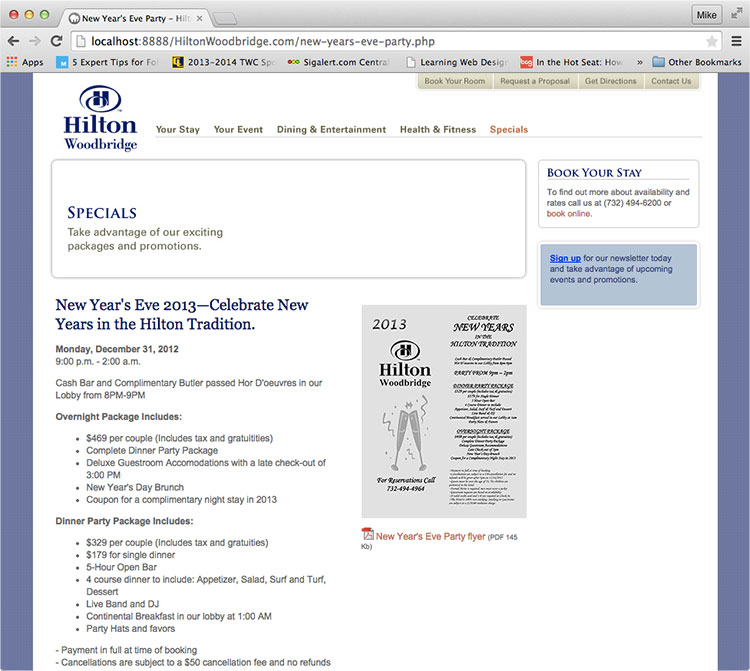

  
`HiltonWoodbridge.com`  

# Dates:  
2008 - 2011  
# Technologies:  
Photoshop, Dreamweaver, HTML4, CSS2, jQuery plugin
# Description:  
This website is meant to give information to hotel guests regarding the amenities and services available.  It also gives out information regarding upcoming special events, promotions and deals throughout the year.  

I oversaw the maintenance and updates to the events section, updated the event calendars and created landing pages to said events.  I also installed and customized a jQuery plugin called prettyPhoto which is a lightbox clone.  It presents pictures and videos in a new way. 
# Screenshots:
  

  

  

  

  
